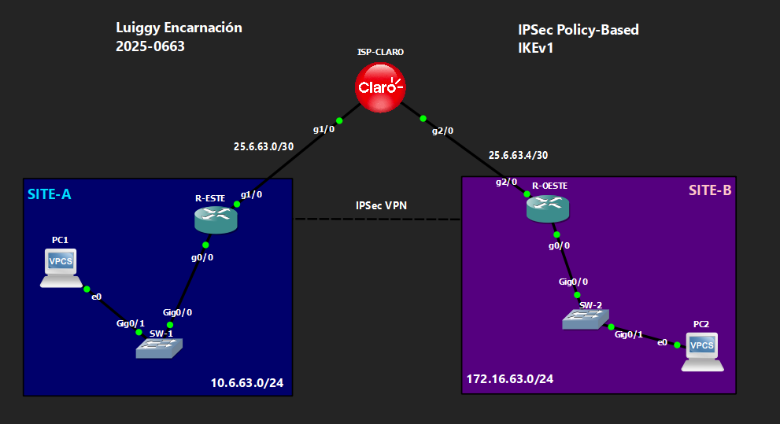

# 🔒 VPN Site-to-Site IPSec Policy-Based — IKEv1
 
**Luiggy Habraham Encarnación Cabrera · Matrícula 2025-0663**
 


> VPN site-to-site IPSec basada en políticas (ACL + crypto map) con IKEv1, sin interfaz de túnel dedicada.

---

## 📑 Tabla de Contenido

1. [Objetivo del Laboratorio](#-objetivo-del-laboratorio)
2. [Parámetros Usados](#-parámetros-usados)
3. [Documentación de la Red](#️-documentación-de-la-red)
4. [Funcionamiento de la VPN](#-funcionamiento-de-la-vpn)
5. [Configuración](#-configuración)
6. [Verificación](#-verificación)
7. [Capturas de Pantalla](#-capturas-de-pantalla)
8. [Video de Demostración](#-video-de-demostración)

---

## 🎯 Objetivo del Laboratorio

Configurar una VPN site-to-site **IPSec basada en políticas (policy-based)** con **IKEv1**, donde el tráfico a cifrar se define mediante una **ACL** referenciada en un `crypto map` aplicado directamente sobre la interfaz WAN — sin usar una interfaz de túnel dedicada. El objetivo es entender el modelo "tradicional" de IPSec, donde solo el tráfico que coincide exactamente con la ACL (LAN de SITE-A hacia LAN de SITE-B) es cifrado.

---

## 🧩 Parámetros Usados

| Parámetro | Valor |
|---|---|
| Versión IKE | IKEv1 (ISAKMP) |
| Cifrado Fase 1 | AES 256 |
| Hash Fase 1 | SHA |
| Autenticación | Pre-shared key (`Luiggy20250663!`) |
| Grupo DH | 14 |
| Lifetime Fase 1 | 86400 s |
| Transform-set (Fase 2) | esp-aes 256 / esp-sha-hmac |
| Modo IPSec | Túnel |
| Tráfico interesante | ACL extendida (`VPN_to_SITEB` / `VPN_to_SITEA`) |
| Enrutamiento dinámico | No soportado (sin interfaz de túnel) |

---

## 🗺️ Documentación de la Red

### Topología



### Tabla de Direccionamiento

| Dispositivo | Interfaz | IP | Red |
|---|---|---|---|
| ISP-CLARO | g1/0 | 20.6.63.2/30 | Enlace hacia R-ESTE |
| ISP-CLARO | g2/0 | 30.6.63.2/30 | Enlace hacia R-OESTE |
| ISP-CLARO | Lo0 | 20.20.20.20/32 | Loopback de pruebas |
| R-ESTE | g1/0 (WAN) | 25.6.63.1/30 | Hacia ISP |
| R-ESTE | g0/0 (LAN) | 10.6.63.1/24 | SITE-A |
| R-OESTE | g2/0 (WAN) | 25.6.63.6/30 | Hacia ISP |
| R-OESTE | g0/0 (LAN) | 172.16.63.1/24 | SITE-B |

> ⚠️ Nota técnica: el archivo fuente define las interfaces del ISP en `20.6.63.0/30` y `30.6.63.0/30`, mientras que los peers de la VPN usan `25.6.63.1` y `25.6.63.6`. Verifica la coherencia de direccionamiento en tu topología real antes de desplegar.

### Detalles del Entorno

| Parámetro | Valor |
|---|---|
| Emulador | GNS3 / Packet Tracer |
| Dispositivos Cisco | IOU / Router IOS |
| VLANs | VLAN 1 (default) en SW-1 y SW-2 |
| Sitios | SITE-A (10.6.63.0/24), SITE-B (172.16.63.0/24) |

---

## 🔬 Funcionamiento de la VPN

**Fase 1 (ISAKMP/IKEv1):**
- `crypto isakmp policy 10`: AES-256, SHA, pre-share, grupo DH 14, lifetime 86400.
- `crypto isakmp key Luiggy20250663!` amarrada a la IP pública del peer remoto.

**Fase 2 (IPSec) — sin interfaz de túnel:**
- `crypto ipsec transform-set VPN-SET esp-aes 256 esp-sha-hmac` en **modo túnel**, ya que se encapsula el paquete IP original completo dentro de un nuevo paquete IP cifrado.
- El **tráfico interesante** se define con una ACL extendida que permite explícitamente `10.6.63.0/24 <-> 172.16.63.0/24`.
- El `crypto map VPN-MAP` amarra: peer remoto + transform-set + ACL, aplicado sobre la interfaz WAN física.

**Limitación clave del modelo policy-based:**
- Al no existir una interfaz Tunnel0, **no se puede correr un protocolo de enrutamiento dinámico** sobre la VPN, porque el tráfico multicast/broadcast de OSPF/EIGRP no coincide con la ACL de tráfico interesante.

---

## 🔧 Configuración

Ver archivo: `Configuración para VPN IPSec Policy-Based IKEv1.txt`

---

## ✅ Verificación

```
show crypto isakmp sa
show crypto ipsec sa
```

Se espera:
- `show crypto isakmp sa` → estado **QM_IDLE**.
- `show crypto ipsec sa` → contadores `#pkts encaps` / `#pkts decaps` incrementando al hacer ping entre LANs.

---

## 📸 Capturas de Pantalla

```
evidencias/
├── 01_topologia.png
├── 02_show_crypto_isakmp_sa.png
├── 03_show_crypto_ipsec_sa.png
└── 04_wireshark_esp_trafico.png
```

---

## 🎬 Video de Demostración

> 📺 **[Ver demostración en YouTube →](https://youtu.be/NTHj-D605u0)**
